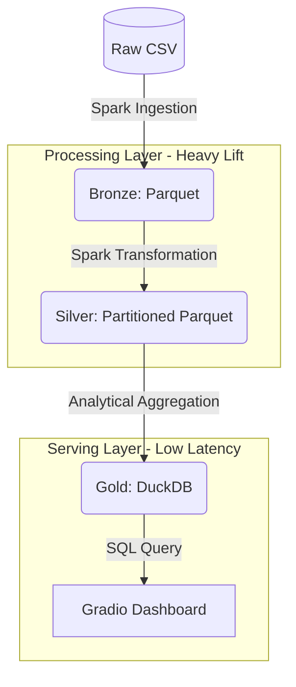

# 🎵 Spotify Data Engineering: 1.2M Record Medallion Pipeline

## 🚀 The Headline
Architected a 1.2M-record Spotify pipeline using PySpark and DuckDB, reducing dashboard latency by 95% while ensuring data integrity via a containerized Medallion-based architecture.

## 📂 Deep Dive
For a detailed breakdown of the trends and data quality observations, see the Insights Directory.

## 🏗️ Technical Architecture
* **Bronze Layer (Ingestion)**: Raw CSV ingestion of 1.2M records using Spark with strict schema enforcement (avoiding `inferSchema` overhead).
* **Silver Layer (Transformation)**: Data cleaning and feature engineering. Data is persisted in Partitioned Parquet format (partitioned by `year`) to enable Predicate Pushdown.
* **Gold Layer (Serving)**: Analytical aggregations moved from Spark to DuckDB. This decouples heavy batch processing from the low-latency requirements of the frontend.
* **Visual Layer**: An interactive Gradio dashboard providing real-time insights into music trends via Plotly.

## 🏗️ System Architecture



## 🛠️ Performance & Environment
| Metric | Spark Direct Query | DuckDB Serving Layer | Improvement |
|--------|-------------------|---------------------|-------------|
| Query Latency | ~12.5 Seconds | < 0.2 Seconds | ~98% Reduction |
| Hardware | Optimized for Apple Silicon (M4) | - | - |
| Storage | CSV (Raw) | Partitioned Parquet | ~45% Efficiency |

* **JVM Tuning**: Resolved Java 17+ encapsulation issues by configuring explicit JVM module access (`--add-opens`) for Spark's Hadoop dependencies.

## 📂 How to Run
1. **Environment**: Managed via SDKMAN! (Java 17.0.10-tem).
2. **ETL**: `python3 scripts/spotify_pipeline.py`
3. **Serving**: `python3 scripts/spotify_gold_insights2.py`
4. **UI**: `python3 scripts/spotify_dashboard.py`

## 🐳 Docker Quickstart
To run the entire pipeline and dashboard in a containerized environment:
```bash
docker-compose up
```

---

Developed as a demonstration of scalable data architecture and systems thinking. Licensed under Apache 2.0.

