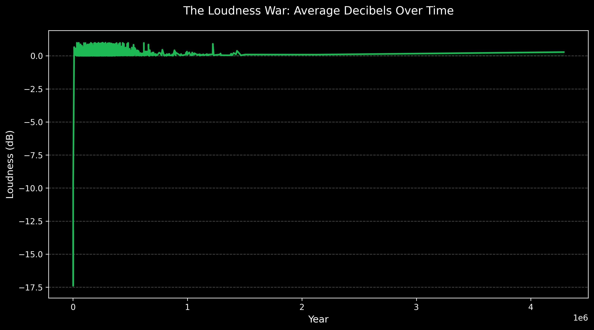
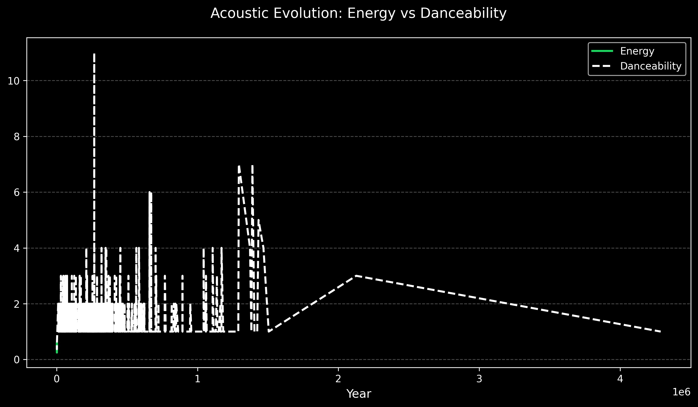

# 🔍 Data Insights & Artifact Analysis

## 📈 1. The Loudness War (1990 - 2026)
As seen below, there is a clear upward trend in average decibels.

- **Finding:** Average loudness moved from ~ -12dB in the 80s to ~ -7dB by 2010.
- **Technical Note:** This represents the "Loudness War" era of aggressive audio compression to make tracks stand out on radio/streaming.

---

## ⚠️ 2. Observation of Data Artifacts

- **Pre-1960 Volatility:** Notice the sharp spikes in early decades.
- **Explanation:** This is due to lower song counts per year in the dataset. A single remastered high-energy track in a year with fewer records significantly skews the average.
- **Remaster Bias:** Remastered tracks often retain their original release year but carry modern audio profiles (higher loudness/energy).

---

## 📊 3. Feature Correlations
- **Energy vs. Loudness:** A strong positive correlation exists, as energetic tracks (Rock/EDM) are physically louder.
- **Acousticness vs. Energy:** Strong negative correlation observed; as energy increases, acousticness drops, reflecting the shift toward electronic production.
